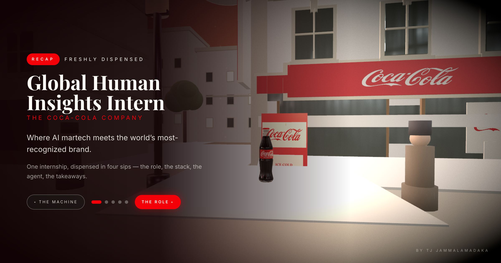

# Coke-Recap

Built as the capstone of my Coca-Cola internship: an interactive 3D recreation of Five Points, Atlanta as it looked in 1886, the block around Jacobs' Pharmacy where Coca-Cola was first served on May 8, 1886. The whole scene runs in the browser at golden hour, and you explore it by dragging to look around and clicking your way through the diorama.

🥤 **Live:** [coke-recap.vercel.app](https://coke-recap.vercel.app)



## What it is

Instead of a static page, the site is a miniature 3D diorama of the historic 1886 pharmacy block. Press **START** and the camera settles into a wide establishing shot. From there you can click points of interest, use the chapter pills (or keys **1–4**) to fly the camera to different vantage points, and drag to look around. **ESC** returns home, and the chapter views are deep-linkable, so a shared link drops the viewer straight into a specific spot.

## Built with

| Layer | Tech |
|---|---|
| Framework | [Vite](https://vitejs.dev) + [React 19](https://react.dev) + TypeScript |
| 3-D | [@react-three/fiber](https://docs.pmnd.rs/react-three-fiber) v9, [drei](https://docs.pmnd.rs/drei), [three](https://threejs.org) 0.184 |
| Post-processing | [@react-three/postprocessing](https://docs.pmnd.rs/react-postprocessing) (SSAO, bloom, vignette, film grain) |
| UI | [Tailwind CSS](https://tailwindcss.com) 3.4 |
| Hosting | [Vercel](https://vercel.com) |

## Running locally

```bash
npm install
npm run dev       # local dev server
npm run preview   # serve the production build locally
```

## Music

*"Fig Leaf Times Two"* by **Kevin MacLeod** ([incompetech.com](https://incompetech.com)), licensed under [Creative Commons: By Attribution 3.0](https://creativecommons.org/licenses/by/3.0/).

## Author

**Tarang Jammalamadaka**
[GitHub](https://github.com/tarang-tj) · [LinkedIn](https://linkedin.com/in/tarang-jammalamadaka)
